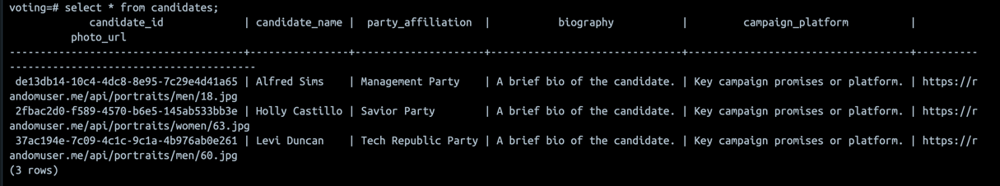

Realtime Election Voting System
===============================
In this repository we have the code for realtime voting system. We have used technologies like Python , Kafka, Spark Streaming , Postgres and for dashboard creation used Streamlit.  
The system is built using Docker Compose to easily spin up the required services in Docker containers.

## System Architecture


To run docker composer file . Use below command 
```bash
docker-compose up -d
```


### Running the App
1. Install the required Python packages using the following command:

```bash
pip install -r requirements.txt
```

2. Creating the required tables on Postgres and generating voter information on Kafka topic:

```bash
python main.py
```

3. Consuming the voter information from Kafka topic, generating voting data and producing data to Kafka topic:

```bash
python voting.py
```

4. Consuming the voting data from Kafka topic, enriching the data from Postgres and producing data to specific topics on Kafka:

```bash
python spark-streaming.py
```

5. Running the Streamlit app:

```bash
streamlit run streamlit-app.py
```

## Output
### Candidates and Parties information

### Voters


### Voting


### Dashboard

